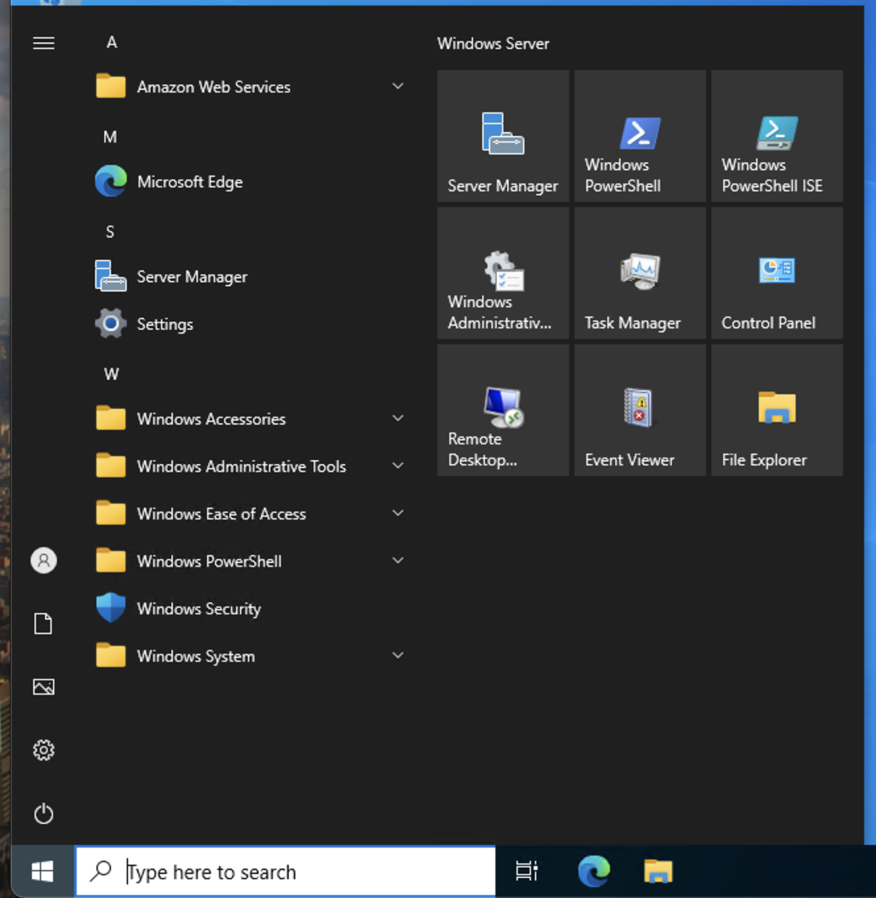
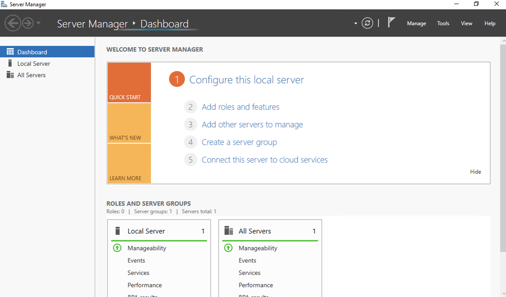
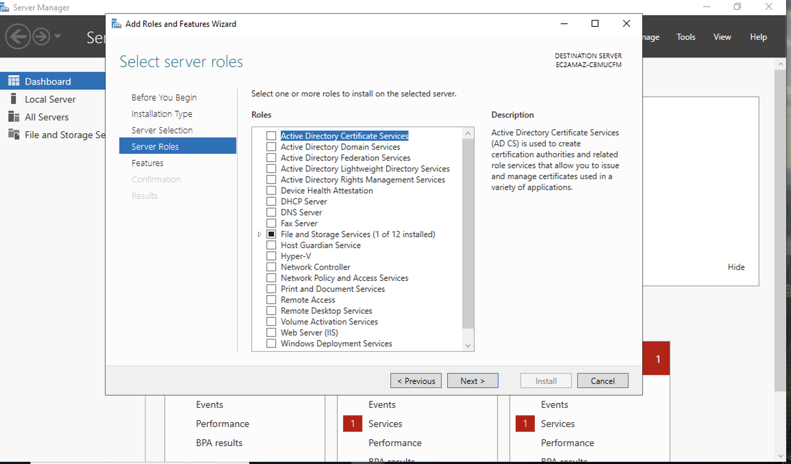
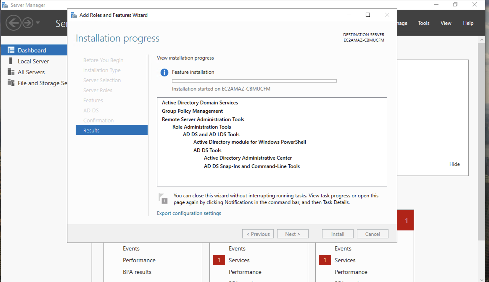
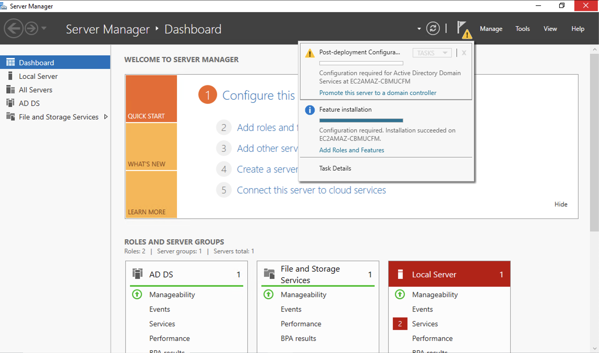
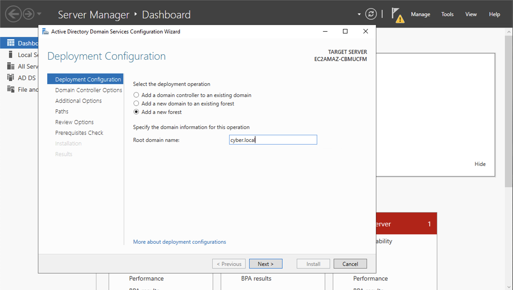
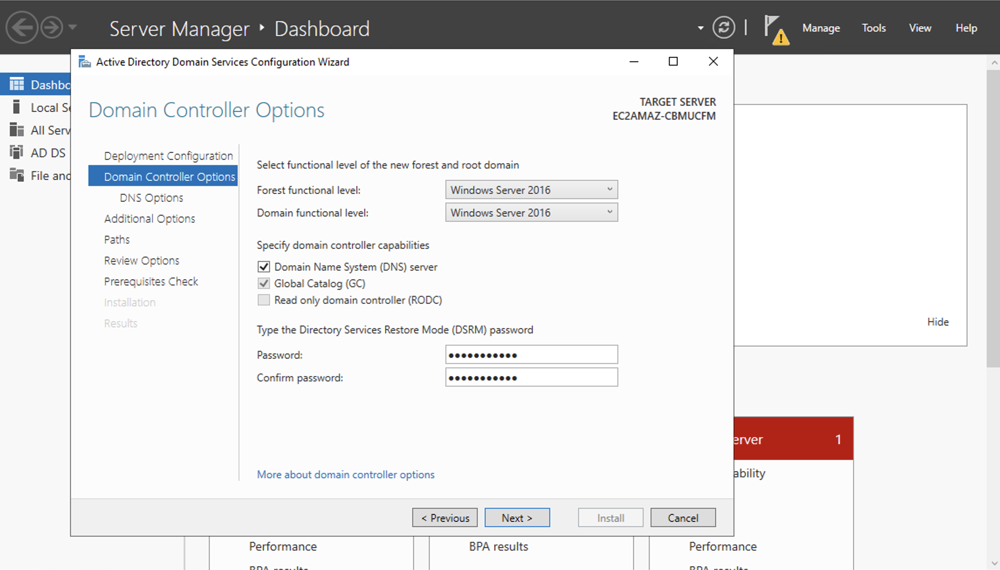
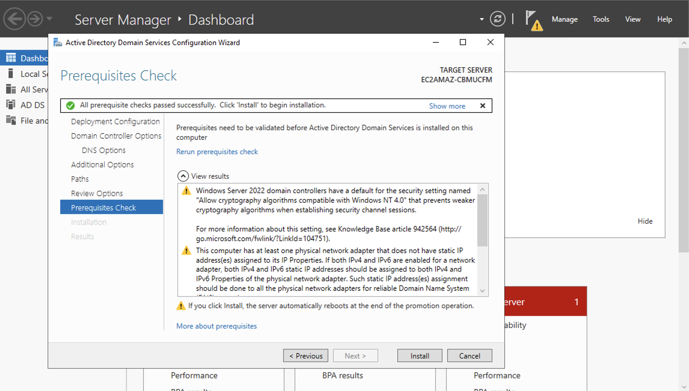
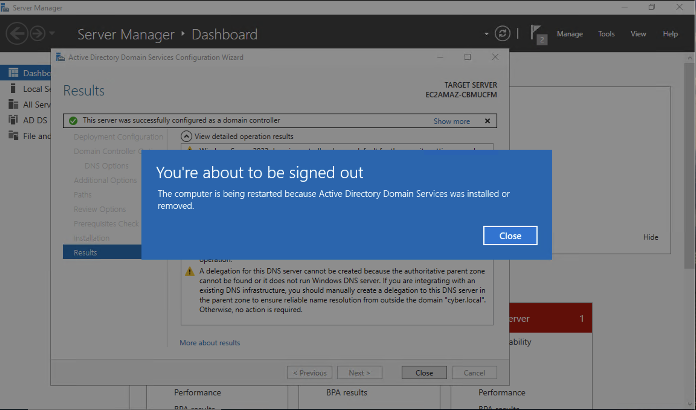

# Installing Active Directory on a Server 🖥️
-This lab illustrates how to install **Active Directory** on a Windows Server
### Step 1: Opening the Server Manager
- To open the **Server Manager**, select the Windows icon on the bottom left hand side, and from there you should see the **Server Manager** application on the right hand side. Go ahead and open it

### Step 2: Installing Active Directory Domain Services
- Within the **Server Manager**, you are going to select **Manage** -> **Add Roles and Features** (Click **Next** until you get to 'Server Roles') -> when you get to **Server Roles** go ahead and only select **Active Directory Domain Services**
 

- Continue to click **Next** until you reach the the page where it asks you to install the services
- **NOTE**: Sit back and relax, it might take a couple of minutes for the services to install

### Step 3: Promote the Server to a Domain Controller
- After the installations of the services are completed, on the top of the **Server Manager** you are going to click on the flag with the **Caution Symbol**, and lauch the setup wizard to promote the server to **Domain Controller**

- Upon starting the **Wizard**, select **Add New Forest**, and for the sake of fluidity, I named this one **Cyber.local** to match my locally configured AD Server on VirtualBox. However, you as the user can name it as you please. 

- After you click **Next**, you will be prompted to add a password for the **Domain Controller** account

- Click **Next** until you get stopped for the system to go through its prerequisite checks for the system
- After its finished, click **Install** on the bottom right of the wizard, and after its completed, the server will automatically restart

## Demo Video🎥
- [Installing AD](https://www.loom.com/share/5ffa3356ddbd4546a3db115f6dea7bd6?sid=11ccc3da-2dc6-4be7-a745-04e7701c08ff)
